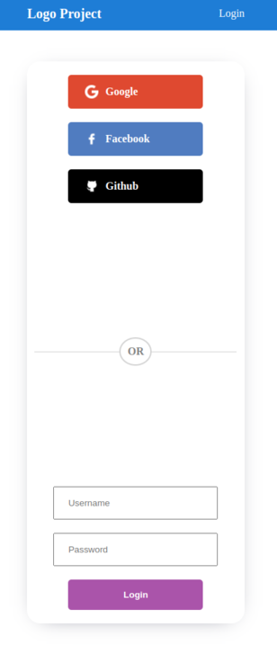
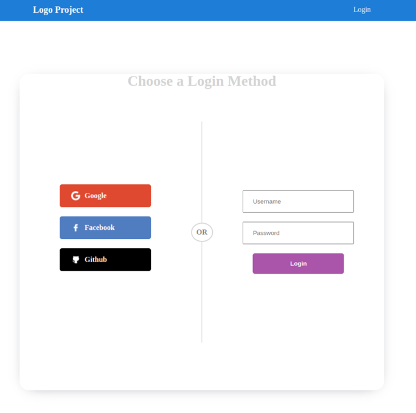

# Social Login with Passport.js

 this is a React project, written in **JavaScript** and
styled with **CSS**, for the login authentication with social media (Google, Github).

## Tech Stack

**Backend:** Node.js, Express 
 

**Frontend:** React
 

**Libraries:** Passport.js

 
 
 

> Mobile Version

 

> Desktop Version

 
 